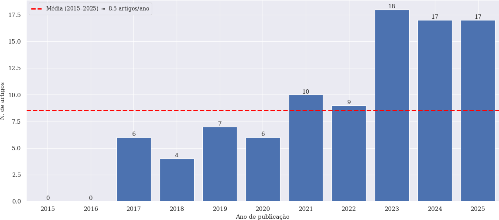
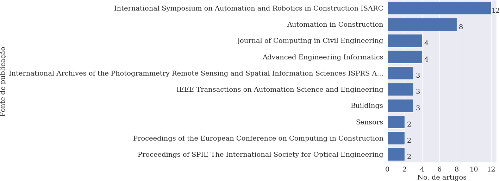
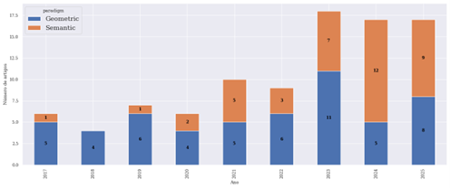
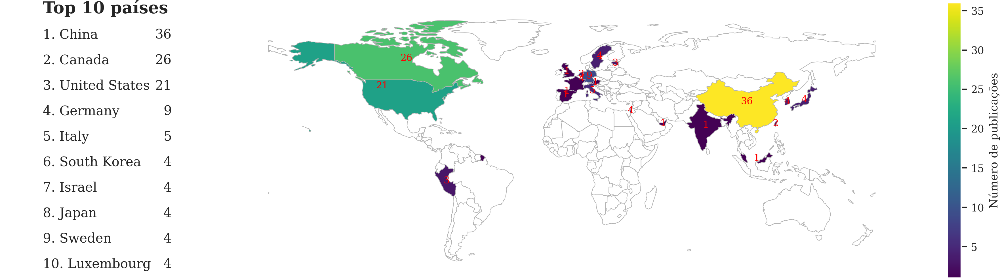
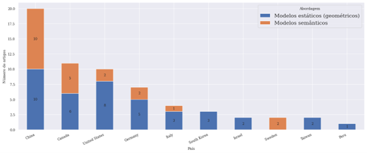

# DE MODELOS ESTÁTICOS À NAVEGAÇÃO SEMÂNTICA: A INTEGRAÇÃO ENTRE BIM E ROBÓTICA MÓVEL

## Resumo
Modelos BIM tradicionais têm sido utilizados como representações estáticas de ambientes, podendo servir como mapas para robôs autônomos. Contudo, recentemente, com a melhoria do custo-benefício de sensores, como os do tipo LiDAR, tem-se observado a possibilidade de conectar essas informações à realidade dinâmica do ambiente, seja para a atualização do modelo, gerando Digital Twins alinhados à realidade, seja para a navegação de robôs por meio do uso de informações semânticas. Este trabalho apresenta um mapeamento sistemático da literatura com o objetivo de investigar a integração entre BIM e robótica móvel. A pesquisa baseia-se em uma busca estruturada em bases consolidadas da literatura, como Scopus e Web of Science. As fontes selecionadas foram analisadas de forma qualiquantitativa de forma automatizada, com o apoio de ferramentas de Processamento de Linguagem Natural. O estudo busca mapear a evolução da área, identificando a transição de abordagens fundamentadas em geometria simples para aquelas voltadas à navegação semântica. Dessa forma, esse mapeamento fornece um panorama das principais estratégias adotadas e apontar direções emergentes para pesquisas futuras. 

## Resultados

Número de artigos por ano de publicação na última década:

Principais fontes de publicação do tema:

Evolução temporal das abordagens geométricas e semânticas na integração BIM–Robótica:

Países de afiliações dos autores dos artigos selecionados, com a indicação dos 10 países com maior número de autores:

Distribuição das abordagens de navegação (modelos estáticos e semânticos) por país:

### Artigos selecionados

Lista dos 94 artigos selecionados para o mapeamento sistemático, contendo o escore e o paradigma principal do trabalho, além dos principais dados: [link](papers_picoc_score_with_paradigm.xlsx).

## Cite us

